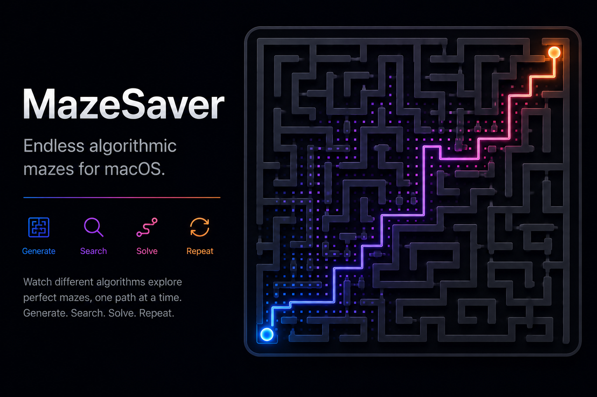
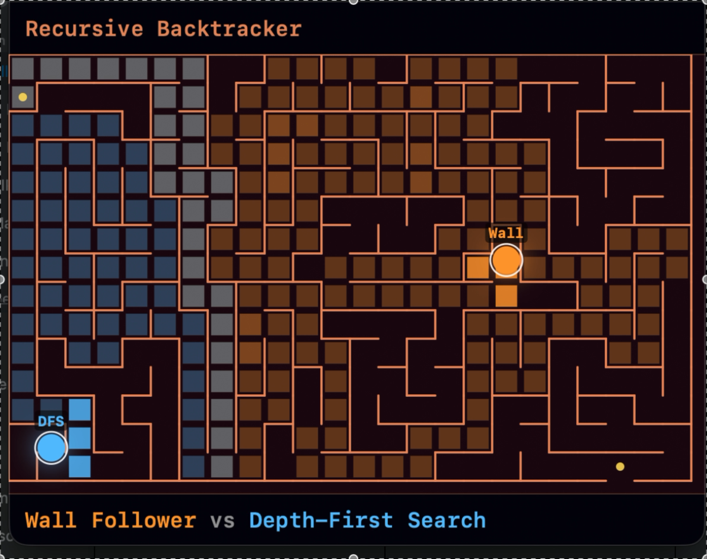
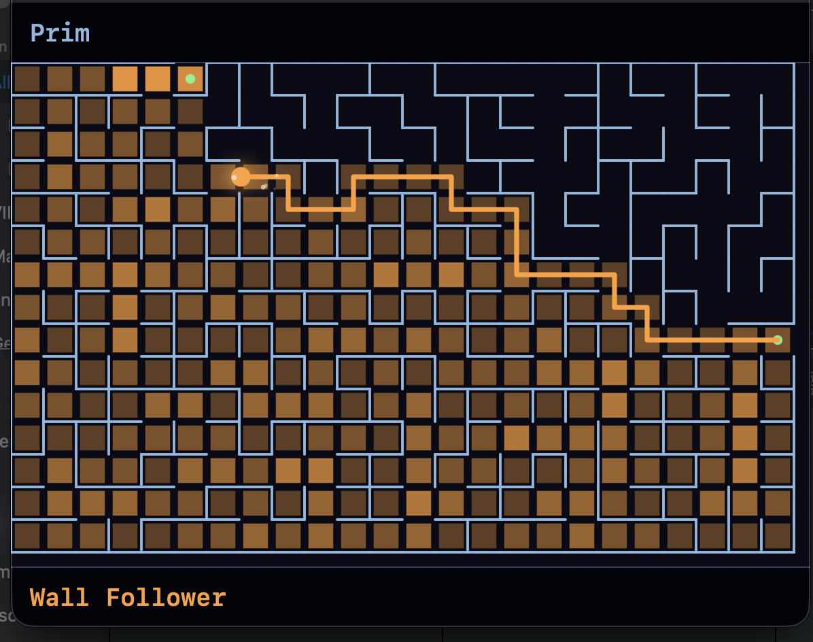

# MazeSaver
### An endless, algorithm-driven maze screensaver for macOS




---

## ✨ Quick Start (2 minutes)

```bash
git clone https://github.com/footprintsonthemoon/mazesaver.git
cd mazesaver
swift run
```

➡️ That's it.
A window opens with a maze generating and solving itself.

Want the actual macOS screensaver instead? Jump to [Installation](#-installation).

---

## 🎬 Demo

[](Assets/README/demo.mov)

*(click the image to play the video — a Wall Follower vs. Depth-First
Search race, shown above)*

---

## 🧠 Concept

Years ago, under Linux, a small program generated a maze (a plain `X`-and-space
grid) and drove a little "vehicle" through it with a search algorithm — from one
screen edge to another. The moment it found the exit, a **new** maze was
generated, with the old exit as the new entrance.

MazeSaver rebuilds that idea natively for macOS:

- A perfect maze is generated (exactly one path between any two cells, always
  solvable, no isolated areas).
- A search algorithm explores it, visibly, cell by cell.
- A ball retraces the found path.
- The next maze picks up exactly where the last one left off — same edge
  position, opposite side of the screen — so the journey never really stops.

Everything after that is watching the algorithms work.

---

## 🏗️ How one "round" flows

```
+-------------------------------------------+
|  Generate maze                             |
|  (previous exit becomes the new entrance)   |
+---------------------+-----------------------+
                      |
                      v
+-------------------------------------------+
|  Search                                     |
|  DFS / BFS / A* / Wall Follower /           |
|  Random Walk — ball rides the search        |
|  frontier, colored per algorithm            |
+---------------------+-----------------------+
                      |
                      v
+-------------------------------------------+
|  Settle (2s) -> Travel -> Arrived (5s)      |
|  solution trail is drawn as the ball walks  |
|  it, over the search pattern, not replacing |
|  it; arrival stats shown before moving on   |
+---------------------+-----------------------+
                      |
                      v
+-------------------------------------------+
|  Crossfade into the next maze               |
+-------------------------------------------+
```

---

## 🧩 Maze generators

Cycled independently of the search algorithm, every maze.

### Recursive Backtracker

Randomized depth-first carving. Produces long, winding corridors with
relatively few, short dead ends — the "classic" hand-drawn maze look.

### Prim

Randomized Prim's algorithm: grows outward from the entrance by repeatedly
pulling in a random cell adjacent to the maze so far. Produces more evenly
branching mazes than the backtracker.

### Wilson

Loop-erased random walks. Unlike the other two, it has **no directional
bias** — it samples uniformly at random among *all* possible perfect mazes on
the grid. Visibly more "organic" and unpredictable.

All three always produce a **perfect maze**: a spanning tree over the grid,
so there's exactly one route between the entrance and the exit — no loops,
no unreachable pockets.

---

## 🔍 Search algorithms

Cycled round-robin, with two special modes mixed in (see below).


<p align="center"><em>Prim-generated maze, solved by Wall Follower — the brighter orange
cells are ones the search stepped through more than once.</em></p>

### Depth-First Search

Follows one corridor as deep as it can, backtracking on dead ends. Looks
searching and a little chaotic — you'll see small fading rings appear where
it abandons a dead end and jumps back to continue elsewhere.

### Breadth-First Search

Expands outward in rings from the entrance, like a wave. Always finds a
*shortest* path in this unweighted grid.

### A\*

Breadth-first search steered by a Manhattan-distance heuristic toward the
exit. Visibly more directed than plain BFS — you can watch the heuristic
pull the frontier toward the goal instead of spreading evenly.

### Wall Follower

Hugs the right or left wall the entire way (chosen at random each run).
Because a perfect maze has no loops, this is *guaranteed* to reach the exit
eventually — it's the closest thing to how an actual person would feel their
way through a physical maze.

### Random Walk ("chaos mode")

No memory, no strategy — picks a random open direction each step (with a
mild bias against immediately reversing). Capped and, in the rare case it
doesn't reach the exit in time, backed by a safety-net shortest path so the
screensaver never stalls. Doesn't take part in the normal rotation; it shows
up on its own as an occasional surprise (see below).

---

## 🎲 Race & Chaos modes

Every few mazes, the normal rotation is interrupted:

- **Race** (~25% of mazes, guaranteed at least every 4th) — two algorithms
  search the *same* maze side by side, each colored and labeled. Since a
  perfect maze has exactly one route between any two points, both would find
  the *identical* path — so the race that actually matters is the search
  itself: whichever algorithm finishes exploring first wins, and only its
  ball goes on to replay the route, at normal speed.
- **Chaos** (~10%, guaranteed at least every 6th) — a single maze solved by
  Random Walk.

---

## 🎨 What you'll notice while watching

- Each algorithm has its own accent color, used consistently for its
  frontier highlight, explored cells, ball, and footer label.
- Cells the search revisits (Wall Follower, Random Walk) get visibly
  brighter with each extra visit — a deliberate "heat" effect, not an
  accident (see the screenshot above).
- The solution trail grows behind the ball as it actually walks the path,
  drawn *over* the search pattern rather than replacing it.
- A confetti burst on arrival, a faint sparkle trail during travel, and a
  short "N visited / M on path / efficiency%" stats readout before the next
  maze fades in.
- The ambient color palette (walls, background, entry/exit markers — not the
  algorithm colors) cycles through a handful of themes every 8 mazes, so a
  screensaver left running for hours doesn't stay visually static.
- The whole grid dynamically resizes to whatever window or screen it's
  given, at launch and on resize.

---

## 📦 Installation

### Option A: just download it

No build tools needed. Grab the latest zips from
**[Releases](https://github.com/footprintsonthemoon/mazesaver/releases/latest)**:

- **Screensaver** — download `MazeSaver-Screensaver.zip`, unzip, then:
  ```bash
  cp -R MazeSaver.saver ~/Library/Screen\ Savers/
  ```
  Then: **System Settings → Screen Saver → MazeSaver**.

- **App** — download `MazeSaver-App.zip`, unzip, then drag `MazeSaver.app`
  into `/Applications`.

> These builds are ad-hoc signed, not notarized with a paid Developer ID —
> on first launch macOS Gatekeeper will say it's from an unidentified
> developer. **Right-click (or Control-click) the file and choose *Open***
> instead of double-clicking, confirm once, and it'll launch normally every
> time after that.
>
> macOS also runs third-party screensavers through a compatibility layer
> (`legacyScreenSaver`) rather than as a first-class extension these days —
> the classic `.saver` bundle format still works, it's just not something
> Apple is actively investing in anymore.

### Option B: build it yourself

Only the Xcode **Command Line Tools** are required — not the Xcode app.

```bash
xcode-select --install   # if you don't already have them
git clone https://github.com/footprintsonthemoon/mazesaver.git
cd mazesaver
```

**Screensaver:**

```bash
./Scripts/build-saver.sh
cp -R build/MazeSaver.saver ~/Library/Screen\ Savers/
```

Then: **System Settings → Screen Saver → MazeSaver**.

**Standalone app:**

```bash
./Scripts/build-app.sh
open build/MazeSaver.app
```

Drag `build/MazeSaver.app` into `/Applications` to keep it around. The
window is resizable — the maze regenerates to fit whatever size you give it.

**Both at once, zipped up like the release assets:**

```bash
./Scripts/build-release.sh
```

### Development

For iterating on the code itself, skip the packaging scripts:

```bash
swift run       # builds and launches the windowed app directly
swift build     # just build
```

The screensaver target isn't part of the SwiftPM build graph (App Extension
bundles need their own bundle structure that SwiftPM doesn't produce) — it's
compiled directly by `Scripts/build-saver.sh` via `swiftc`, `lipo`, and
`codesign`, from the exact same `Sources/MazeCore` files the app uses.

---

## 🗂️ Project layout

```
Sources/
├── MazeCore/                Shared engine + rendering (used by both targets)
│   ├── MazeGrid.swift        grid, walls, edge openings
│   ├── MazeGenerator.swift   Recursive Backtracker / Prim / Wilson
│   ├── Pathfinding.swift     DFS / BFS / A* / Wall Follower / Random Walk
│   ├── MazeEngine.swift      state machine: search -> settle -> travel -> arrive -> crossfade
│   └── MazeView.swift        Core Graphics rendering, effects, layout
├── MazeSaverApp/             Standalone windowed app (SwiftPM executable)
│   └── main.swift
└── MazeSaverScreenSaver/     ScreenSaverView subclass (built outside SwiftPM)
    ├── MazeSaverView.swift
    └── Info.plist

Packaging/
├── App-Info.plist             Info.plist for the .app bundle
└── AppIcon.icns                generated by Scripts/build-icon.sh

Assets/
├── icon.png                    source artwork for AppIcon.icns
└── README/                     images/video used in this file

Scripts/
├── build-icon.sh                -> Packaging/AppIcon.icns
├── build-app.sh                  -> build/MazeSaver.app
└── build-saver.sh                -> build/MazeSaver.saver
```

`MazeCore` is a normal Swift module the app links against; the screensaver
bundle compiles those same source files directly alongside its
`ScreenSaverView` subclass in one `swiftc` invocation, so there's exactly one
copy of the maze/search/rendering logic behind both.

---

## 🎯 Philosophy

Generate. Search, visibly. Walk the path found. Start again where you left
off.

No two mazes ever look the same, and the search always looks different, too.
