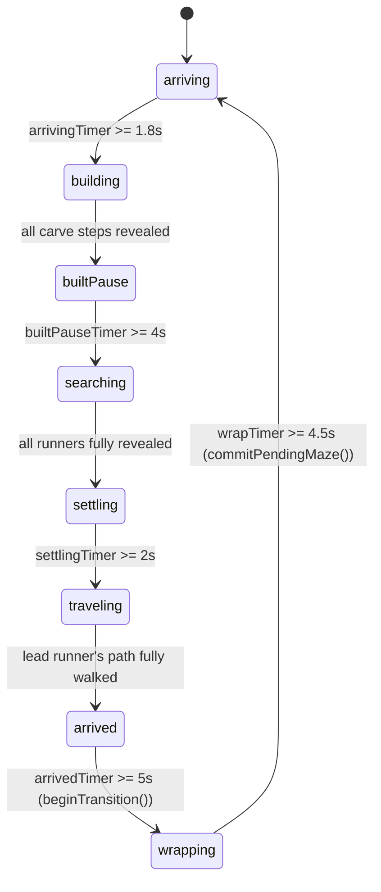

# MazeSaver — Specification

This document specifies MazeSaver precisely enough to rebuild it from scratch,
without needing to read the existing source. It loosely follows the
[arc42](https://arc42.org) template, adapted for a small, single-repository
project:

- **Building Block View** and **Runtime View** are merged into one expanded
  **Behavior Specification** (§6) — for this project, the exact runtime
  choreography (state transitions, timings, color rules, animation formulas)
  *is* the specification that matters most for a faithful rebuild, more than
  a static component diagram would be.
- Sections that would be boilerplate for a project this size (e.g. a
  stakeholder-by-stakeholder risk register) are kept short.
- All numeric constants are collected once more in **Appendix A** as a single
  reference table, in addition to appearing inline where they're used.

Language/runtime facts throughout this document reflect the state of the
`main` branch as of this writing (Swift tools version 5.10, built with Swift
6.3.2 / Xcode Command Line Tools, macOS 13+ deployment target).

---

## Table of contents

1. [Introduction and Goals](#1-introduction-and-goals)
2. [Constraints](#2-constraints)
3. [Context and Scope](#3-context-and-scope)
4. [Solution Strategy](#4-solution-strategy)
5. [Building Block View](#5-building-block-view)
6. [Behavior Specification (Runtime View)](#6-behavior-specification-runtime-view)
7. [Deployment View](#7-deployment-view)
8. [Crosscutting Concepts](#8-crosscutting-concepts)
9. [Architecture Decisions](#9-architecture-decisions)
10. [Quality Requirements](#10-quality-requirements)
11. [Risks and Technical Debt](#11-risks-and-technical-debt)
12. [Glossary](#12-glossary)
13. [Appendix A: Constants Reference](#13-appendix-a-constants-reference)

---

## 1. Introduction and Goals

### 1.1 What it is

MazeSaver is a macOS screensaver (`.saver`) and standalone windowed app
(`.app`) that endlessly generates perfect mazes and visibly solves them with
a rotating cast of search algorithms. Each maze's exit becomes the next
maze's entrance, so the whole thing reads as one continuous journey rather
than a series of unrelated puzzles.

### 1.2 Origin / elevator pitch

Years ago, a small Linux program generated a plain-text (`X`-and-space) maze
and drove a "vehicle" through it with a search algorithm, edge to edge; the
moment it found the exit, a new maze was generated using the old exit as the
new entrance. MazeSaver rebuilds that idea natively for macOS, with visible
per-algorithm search animation, multiple maze generators, and considerable
attention paid to the choreography between mazes so the "continuous
corridor" illusion actually reads as intentional.

### 1.3 Goals, in priority order

1. **Watchably correct**: every maze is a genuine perfect maze; every search
   algorithm behaves as advertised and is guaranteed to reach the goal (or
   explicitly documented when it might not — see Random Walk, §6.3.5).
2. **Calm, legible pacing**: this runs unattended for hours as a screensaver;
   nothing should feel rushed, jumpy, or like it's racing a clock. Every
   phase transition has a deliberate pause around it (see §6.2).
3. **No build tooling dependency**: buildable and packageable with only the
   Xcode **Command Line Tools** — no Xcode.app, no `.xcodeproj`.
4. **Single source of truth for the shared logic**: the app and the
   screensaver bundle must not fork or duplicate the maze/search/rendering
   code.
5. **Runs anywhere reasonable**: adapts to whatever window or screen size
   it's given, on both Apple Silicon and Intel.

### 1.4 Stakeholders

Single-maintainer hobby project. The author is both the sole developer and
the primary user (runs it as their own screensaver / demo app).

---

## 2. Constraints

| # | Constraint | Rationale |
|---|---|---|
| C1 | Buildable with Xcode Command Line Tools only (`swift build`, `swiftc`, `lipo`, `codesign`, `sips`, `iconutil` — no Xcode.app) | Goal 1.3.3 |
| C2 | macOS 13.0+ deployment target, universal binary (arm64 + x86_64) | Broad compatibility without dropping Apple Silicon-only builds |
| C3 | `swift-tools-version: 5.10` in `Package.swift` | Pins the SwiftPM manifest format; the toolchain used to build can be newer (verified with Swift 6.3.2) |
| C4 | No external dependencies (no SwiftPM packages, no CocoaPods, no vendored libraries) | Keeps the "no Xcode needed" build trivial; the whole thing is standard-library + AppKit/Core Graphics/ScreenSaver framework only |
| C5 | Ad-hoc code signing only (`codesign --force --sign - --timestamp=none`), not notarized | No paid Apple Developer ID in scope; documented as a Gatekeeper friction point for end users (§11) |
| C6 | The screensaver target cannot be a normal SwiftPM product | `.saver` bundles need an `Info.plist`-driven bundle structure and `NSPrincipalClass` that SwiftPM's executable/library products don't produce — it's compiled directly with `swiftc` instead (§7.2) |

---

## 3. Context and Scope

MazeSaver has **no external interfaces** — no network, no files read/written
beyond its own bundle resources, no persisted state, no user input handling
beyond window resize. It has exactly two "hosts" that embed the same core
engine:

```
┌─────────────────────┐        ┌──────────────────────────┐
│   MazeSaverApp       │        │  MazeSaverScreenSaver     │
│   (windowed .app)     │        │  (.saver, System Settings)│
│                       │        │                            │
│  owns an NSTimer       │       │  driven by ScreenSaverView │
│  @ 60 Hz calling        │      │  .animateOneFrame()        │
│  MazeView.tick(dt:)     │      │  calling the same tick(dt:)│
└──────────┬────────────┘        └────────────┬──────────────┘
           │                                   │
           └───────────────┬───────────────────┘
                            │
                    ┌───────▼────────┐
                    │    MazeCore     │   (shared, see §5)
                    │  grid / gen /    │
                    │  search / engine │
                    │  / view          │
                    └─────────────────┘
```

Both hosts differ only in: how they're driven (owned `Timer` vs.
`ScreenSaverView` callbacks), how they size the initial grid (fixed
44×30-cell window vs. filling the actual screen), and their packaging format.
Everything else — maze generation, search, animation, rendering — is
identical, because it's literally the same source files (§9, ADR-1).

---

## 4. Solution Strategy

| Goal | Strategy |
|---|---|
| Single source of truth (1.3.4) | All maze/search/rendering logic lives in one module, `MazeCore`, consumed identically by both hosts (§9 ADR-1). |
| No Xcode (1.3.3) | The app is a normal SwiftPM executable (`swift build`); the screensaver bundle is hand-assembled with `swiftc -emit-library -Xlinker -bundle` + `lipo` + `codesign`, driven by shell scripts (§7). |
| Watchably correct (1.3.1) | Maze generation always produces a spanning tree (§6.3); every search algorithm is a textbook implementation over the grid graph, with a documented, deliberate exception for Random Walk's step cap (§6.3.5, §11). |
| Calm pacing (1.3.2) | The whole simulation is a single explicit state machine (`MazeEngine.Phase`, §6.2) with a named pause/settle phase between every "eventful" transition, each with its own tunable duration constant. |
| Adapts to any size (1.3.5) | The view recomputes a grid size from its bounds (clamped to the actual screen size) whenever it's laid out, and rebuilds the engine from scratch at that size if it changed (§6.6). |

---

## 5. Building Block View

### 5.1 Package layout

```
Sources/
├── MazeCore/                    Shared engine + rendering (SwiftPM library target)
│   ├── MazeGrid.swift            grid, cells, walls, edge openings
│   ├── MazeGenerator.swift       Recursive Backtracker / Prim / Wilson
│   ├── Pathfinding.swift         DFS / BFS / A* / Wall Follower / Random Walk
│   ├── MazeEngine.swift          state machine driving one maze -> the next
│   └── MazeView.swift            NSView subclass: all Core Graphics rendering
├── MazeSaverApp/                 Standalone windowed app (SwiftPM executable target)
│   └── main.swift                 NSApplication + NSWindow + own Timer
└── MazeSaverScreenSaver/         ScreenSaverView subclass (NOT a SwiftPM target)
    ├── MazeSaverView.swift        ScreenSaverView subclass wrapping MazeView
    └── Info.plist                 bundle Info.plist for the .saver

Packaging/
├── App-Info.plist                Info.plist for the .app bundle
└── AppIcon.icns                  generated by Scripts/build-icon.sh (not committed source)

Assets/
├── icon.png                      source artwork for AppIcon.icns
└── README/                       images/video used in README.md

Scripts/
├── build-icon.sh                  -> Packaging/AppIcon.icns
├── build-app.sh                    -> build/MazeSaver.app
├── build-saver.sh                  -> build/MazeSaver.saver
└── build-release.sh                -> build/MazeSaver-{App,Screensaver}.zip

Package.swift                     SwiftPM manifest (MazeCore + MazeSaverApp only)
```

### 5.2 `Package.swift`

```swift
// swift-tools-version: 5.10
import PackageDescription

let package = Package(
    name: "MazeSaver",
    platforms: [.macOS(.v13)],
    targets: [
        .target(name: "MazeCore", path: "Sources/MazeCore"),
        .executableTarget(name: "MazeSaverApp", dependencies: ["MazeCore"], path: "Sources/MazeSaverApp")
    ]
)
```

`MazeSaverScreenSaver` is deliberately **not** listed here — see ADR-2 (§9).

### 5.3 `MazeCore` — responsibilities per file

| File | Public surface | Responsibility |
|---|---|---|
| `MazeGrid.swift` | `Side`, `Direction`, `GridPos`, `EdgeOpening`, `MazeGrid` | Pure grid data structure: cells, walls as a `Set<Direction>` per cell, wall removal, neighbor lookup, border-opening math. No knowledge of generation or search. |
| `MazeGenerator.swift` | `MazeGeneratorKind`, `CarveStep`, `MazeGenerator` | Three perfect-maze generation algorithms, each returning the exact ordered sequence of wall removals (`[CarveStep]`) so the caller can replay it as a build animation. |
| `Pathfinding.swift` | `SearchAlgorithmKind`, `SearchResult`, `Pathfinding`, `MinHeap` | Five search algorithms over a `MazeGrid`, each returning visit order (for the reveal animation) plus the reconstructed solution path. |
| `MazeEngine.swift` | `MazeEngine` (class), `MazeEngine.Phase` | The state machine: owns the current grid/entrance/exit/runners, ticks phases forward by `dt`, decides what the next maze looks like, manages the entrance/exit continuity handoff. No rendering, no AppKit dependency beyond `Foundation`. |
| `MazeView.swift` | `MazeView` (NSView subclass) | Everything visual: layout (header/footer/grid), Core Graphics drawing per phase, particle effects (confetti/sparkles/puffs), color rules, adaptive resizing. Owns a `MazeEngine` instance and replaces it wholesale when the view resizes to a different grid size. |

`Runner` (in `MazeEngine.swift`) and internal helper types (`WallKey`,
`Particle`, `Puff`, `Theme`, stat-row structs, in `MazeView.swift`) are
private/internal implementation details, described where relevant in §6.

### 5.4 Host targets

| File | Role |
|---|---|
| `Sources/MazeSaverApp/main.swift` | `NSApplicationDelegate` that creates a `MazeEngine(cols: 44, rows: 30)`, wraps it in a `MazeView(cellSize: 24)`, puts that in a resizable `NSWindow`, and drives it with an owned `Timer` at `1/60` s. |
| `Sources/MazeSaverScreenSaver/MazeSaverView.swift` | `ScreenSaverView` subclass. Lazily creates its own `MazeEngine`/`MazeView` pair sized to the screen (`cellSize: 24`, min 10×8 cells) on `startAnimation()`, tears it down on `stopAnimation()`, and forwards `animateOneFrame()` to `MazeView.tick(dt: animationTimeInterval)` (`animationTimeInterval = 1/60`). |

---

## 6. Behavior Specification (Runtime View)

### 6.1 Coordinate and layout model

- `MazeView.isFlipped == true`: row 0 is the **top** of the view, y grows
  downward — matches how the grid is indexed (`row * cols + col`).
- Fixed **header** (44 pt) above and **footer** (44 pt) below the maze grid;
  the maze itself fills the remaining space.
- `cellSize` is a fixed constant per host (24 pt in both) — the grid's
  **column/row count**, not the cell size, is what adapts to the available
  space (see §6.6).
- A cell `(col, row)`'s screen rect: `x = col*cellSize`, `y = row*cellSize +
  headerHeight`, size `cellSize × cellSize`. A cell's center is used for
  markers/balls/trails.

### 6.2 The `Phase` state machine



One `MazeEngine` instance always represents **one currently-committed maze**
plus, during `.wrapping` only, a fully pre-generated **pending** maze
(`pendingGrid`/`pendingEntrance`/`pendingExit`/`pendingRunners`/
`pendingCarveSteps`) waiting to be swapped in.

Per-phase behavior:

1. **`.arriving`** (`arrivingDuration = 1.8s`) — No maze is drawn at all.
   Just the entrance point pulsing quietly (`drawArrivalPing`, §6.5.6), in
   the *previous* maze's lead algorithm color (`previousLeadKind`, or the
   neutral green `markerColor` on the very first maze where there is none).
   A calm beat marking "here's where the new corridor starts" before any
   structure appears.

2. **`.building`** (`buildDuration = 5s` target, see formula below) — The
   maze visibly carves itself into existence by replaying `carveSteps` in
   order. Reveal rate: `rate = max(baseBuildRevealPerSecond, carveSteps.count / buildDuration)`
   carve-steps/second, where `baseBuildRevealPerSecond = 60`; `builtCount`
   accumulates `rate * dt` each tick and is clamped to `carveSteps.count`.
   This makes small mazes always animate at a floor of 60 steps/s (fast,
   since it's meant as a quick prelude, not something to linger on) while
   large mazes still finish within roughly `buildDuration` seconds. Cells
   not yet reached by construction are not drawn *at all* (no walls, no
   markers) rather than shown pre-walled — see `revealedCellIndex` in §6.6.
   Transitions to `.builtPause` once `builtCount >= carveSteps.count`.

3. **`.builtPause`** (`builtPauseDuration = 4s`) — Construction is done; the
   maze sits still. This window exists specifically to host the exit
   marker's own appearance choreography (§6.5.4) without the search
   starting mid-appearance: hidden for the first ~2s, then a ~0.5s fade-in,
   then a further ~1.5s of visible pulsing — all *before* `.searching`
   begins, so the viewer has time to register the goal before the hunt for
   it starts. Transitions to `.searching` after `builtPauseDuration`.

4. **`.searching`** — Each `Runner`'s `revealAccumulator` advances by
   `revealRate(forVisitedCount:) * dt`, where:
   ```
   rate = max(baseCellsRevealedPerSecond, visitedCount / maxRevealDuration)
   rate = isRace ? rate * raceSpeedMultiplier : rate
   ```
   with `baseCellsRevealedPerSecond = 12`, `maxRevealDuration = 18`,
   `raceSpeedMultiplier = 0.55`. I.e. every search finishes revealing within
   `maxRevealDuration` seconds regardless of how many cells it visited
   (never lingers past ~18s, floor of 12 cells/s even on tiny mazes), and
   **race** mazes are deliberately slowed to ~55% speed so a side-by-side
   comparison is actually followable. In a race, the first runner whose
   `revealedCount` reaches its total is recorded as `winnerRunnerIndex` —
   **this is the actual race result**; since a perfect maze has exactly one
   route between any two cells, both algorithms would find the *identical*
   path, so only who *finishes searching* first is meaningful. Transitions
   to `.settling` once every runner's reveal is complete.

5. **`.settling`** (`settlingDuration = 2s`) — A deliberate pause once the
   search is done and before the ball sets off, so "search done" and
   "travel starts" don't blur together. Transitions to `.traveling`.

6. **`.traveling`** — The lead runner's ball (`leadRunnerIndex`, see §6.4)
   walks its solution path at a constant `ballCellsPerSecond = 7` cells/sec
   (not size- or race-scaled). In a race, only the winner's ball continues;
   the loser's copy of the identical path is simply dropped from view (see
   `activeRunnerIndices()`, §6.5.1). Transitions to `.arrived` once
   `pathProgress` reaches the path's last index.

7. **`.arrived`** (`arrivedDuration = 5s`) — The ball rests at the exit. A
   stats banner is shown (§6.5.9). Calls `beginTransition()` after
   `arrivedDuration`, which:
   - Computes the **next** maze's entrance as the *current exit's opposite
     side, same index* (the continuity mechanic, §6.3.1).
   - Fully generates the next maze's grid + carve steps + a fresh set of
     runners (via `pickAlgorithmKinds()`, §6.3.6) — all stored as
     `pending*`, **without** touching the still-visible current maze.
   - Resets `wrapTimer = 0` and sets `phase = .wrapping`.

8. **`.wrapping`** (`wrapDuration = 4.5s`) — The maze itself disappears;
   only the pulsing ball is shown, animating the "wraps around the screen
   edge" illusion (§6.5.7 for the exact sub-choreography). Once
   `wrapTimer >= wrapDuration`, `commitPendingMaze()` runs: it captures
   `previousLeadKind` from the about-to-be-replaced lead runner, swaps
   every `pending*` field into the live fields, clears all `pending*` back
   to `nil`, resets `winnerRunnerIndex = nil` and `arrivingTimer = 0`,
   increments `mazeGeneration`, and sets `phase = .arriving` — closing the
   loop back to step 1.

**Special case — the very first maze**: `MazeEngine.init` builds the first
maze directly (not via `beginTransition()`), with a fixed entrance on the
**west** side at a random row, and always a single plain round-robin
algorithm (no chaos, no race) — race/chaos only start showing up from the
*second* maze onward, once `pickAlgorithmKinds()` is in the loop.

### 6.3 Maze generation

A **perfect maze** here means: the grid is treated as a graph (cells =
nodes, open passages = edges) and generation always produces a **spanning
tree** over it — every cell reachable, no cycles, so there is *exactly one*
route between any two cells. All three generators below satisfy this by
construction (each carve/removeWall call only ever connects a
not-yet-generated cell to the generated set, never creates a second route
between two already-connected cells).

#### 6.3.1 Continuity mechanic (entrance/exit handoff)

- `EdgeOpening { side: Side, index: Int }` — `index` is a row for
  east/west sides, a column for north/south sides.
- `MazeGrid.position(of:)` maps an opening to a cell: west → `(0, index)`,
  east → `(cols-1, index)`, north → `(index, 0)`, south → `(index, rows-1)`.
- `MazeGrid.openBorder(_:)` removes that cell's outward-facing wall so it
  visually connects to the screen edge.
- **The handoff**: `newEntrance = EdgeOpening(side: oldExit.side.opposite, index: oldExit.index)`.
  E.g. if the old maze's exit was on the east edge at row 12, the new
  maze's entrance is on the west edge at row 12 — same physical screen
  position, opposite side, so the ball appears to walk straight through the
  screen edge from one maze into the next.
- The new maze's **exit** side is picked uniformly at random from the three
  sides *other than* its own entrance side (`Side.allCases.filter { $0 !=
  entrance.side }.randomElement()`), with a random index along that side.
  No other constraint — it may end up on any of the remaining three edges.

#### 6.3.2 Recursive Backtracker

Randomized iterative depth-first carve.

```
stack = [start]; mark start generated
while stack is not empty:
    current = stack.last
    unvisitedDirs = shuffle(all 4 directions), filtered to those whose
                    neighbor exists and is not yet generated
    if unvisitedDirs is empty:
        pop stack (backtrack)
        continue
    dir = unvisitedDirs.first
    next = neighbor(current, dir)
    removeWall(current, dir)           # record as a CarveStep
    mark next generated
    push next onto stack
```

Produces long, winding corridors with relatively few, short dead ends — the
"classic" hand-carved-maze look.

#### 6.3.3 Prim (randomized)

Grows outward from the entrance by repeatedly pulling in a random cell
adjacent to the maze so far.

```
mark start generated
frontier = all not-yet-generated neighbors of start
while frontier is not empty:
    cell = remove a uniformly random element from frontier
    dirsTowardMaze = directions from cell toward an already-generated neighbor
    dir = uniformly random choice from dirsTowardMaze
    removeWall(cell, dir)               # record as a CarveStep
    mark cell generated
    add cell's not-yet-generated, not-already-frontier neighbors to frontier
```

Produces more evenly branching mazes than the backtracker (shorter, more
numerous dead ends).

#### 6.3.4 Wilson (loop-erased random walk)

Samples uniformly at random among *all* perfect mazes on the grid — unlike
the other two, it has no directional bias.

```
mark start generated; inMaze = 1; total = cols * rows
order = shuffle(all grid cells)
for candidate in order:
    if candidate already generated: continue

    # loop-erased random walk from candidate until it hits the maze
    path = {}                            # cell -> direction taken from it
    current = candidate
    while current not generated:
        dir = uniformly random direction
        next = neighbor(current, dir)     # if off-grid, just re-roll (no step cost)
        path[current] = dir               # overwriting here IS the loop erasure
        current = next

    # carve the walk from candidate to the maze, following the recorded path
    cell = candidate
    while cell not generated:
        dir = path[cell]
        removeWall(cell, dir)             # record as a CarveStep
        mark cell generated; inMaze += 1
        cell = neighbor(cell, dir)

    if inMaze >= total: break
```

Re-visiting a cell during the random walk simply overwrites its recorded
direction, which erases the loop formed since the previous visit — this is
what makes the algorithm produce an unbiased sample instead of a biased one.
Visibly more "organic" and unpredictable than the other two generators.

### 6.4 Search algorithms

All five operate on `MazeGrid.passableNeighbors(of:)` (cells reachable
through an open wall) and return a `SearchResult { visitedOrder, path }`:
`visitedOrder` drives the reveal animation (§6.2 step 4), `path` is the
reconstructed start→goal route (empty if the goal was never reached).

`SearchAlgorithmKind.roundRobinCases = [.depthFirst, .breadthFirst, .aStar,
.wallFollower]` — **Random Walk is excluded** from the normal rotation; it
only appears as the deliberate "chaos mode" (§6.3.6).

#### 6.4.1 Depth-First Search

Standard stack-based DFS; `visitedOrder` = pop order; parent pointers
recorded on push, path reconstructed by walking parents back from goal.
Looks searching/a little chaotic — visibly backtracks out of dead ends.

#### 6.4.2 Breadth-First Search

Standard array+head-index queue (no removal cost); expands outward in rings
from the entrance like a wave. Always finds a shortest path (unweighted
grid).

#### 6.4.3 A*

Same shape as BFS but pulled from a binary min-heap (`MinHeap<GridPos>`,
priority = `g + heuristic`) instead of a FIFO queue, where
`heuristic(a,b) = |a.col-b.col| + |a.row-b.row|` (Manhattan distance) and
`g` is the path cost so far (uniform step cost 1). Lazy deletion: stale
duplicate heap entries are skipped via a `visited` set checked on pop.
Visibly more directed toward the goal than plain BFS.

#### 6.4.4 Wall Follower

Hugs the right or left wall the entire way — **guaranteed** to reach the
goal because a perfect maze is simply connected (a tree; no loops to get
permanently lost in).

```
facing = startFacing            # direction pointing INTO the grid from the entrance
rightHand = coin flip (once, per run)
maxSteps = cols * rows * 4 + 16  # safety cap: each passage crossed at most twice

while current != goal and steps < maxSteps:
    candidates = rightHand
        ? [turnRight(facing), facing, turnLeft(facing), opposite(facing)]
        : [turnLeft(facing),  facing, turnRight(facing), opposite(facing)]
    pick the first candidate direction with no wall; move there; facing = that direction
    if this is the first time visiting this cell: record its parent (for path reconstruction)
```

`turnRight`/`turnLeft` are the standard 90° rotations
(north→east→south→west→north for right). Because parent pointers are only
recorded on a cell's *first* visit, and the maze is a tree, walking those
parent pointers back from the goal reconstructs the true (unique) shortest
path — even though the wall-follower's own traversal revisits ground.

`startFacing` comes from `MazeEngine.inwardFacing(for:)`: west entrance →
facing east, east → west, north → south, south → north.

#### 6.4.5 Random Walk ("chaos mode")

No memory, no strategy: picks a uniformly random *passable* neighbor each
step, with a mild bias against immediately reversing (excludes the
previous cell from the candidate set *unless* it's the only option).

```
maxSteps = min(cols * rows * 40, 200_000)
while current != goal and steps < maxSteps:
    candidates = passable neighbors of current
    if more than one candidate and a previous cell exists:
        candidates = candidates without the previous cell, if that leaves any
    next = uniformly random choice from candidates
    if first visit to next: record parent
    previous = current; current = next

if goal was reached:
    path = reconstructed path via parents
else:
    path = plain BFS(start, goal).path     # fallback
```

**Deliberate, documented tradeoff**: true random-walk cover time can, in the
worst case, be very large. The step cap is generous (up to 200,000) so it
essentially never trips on realistically-sized screens, but on large
grids/screens it *can*. When it does, the *reveal* animation shows the
random walk cutting off mid-wander, and the ball's travel replay then takes
a visibly different, more direct BFS-shortest-path route instead of
retracing the (never-completed) wander — this is expected, not a bug, and
should be preserved/documented in any rebuild rather than "fixed" by e.g.
raising the cap to infinity (which reintroduces the risk of stalling the
whole screensaver on one maze).

### 6.5 Rendering (`MazeView`)

`draw(_:)` order, every frame:

1. Fill the whole view with the current theme's background color
   (`theme(for: engine.mazeGeneration)`, §6.7).
2. If `phase == .arriving`: draw only the arrival ping (§6.5.6) + header +
   footer, **return early** — nothing else is drawn.
3. If `phase == .wrapping`: draw only the wrap animation (§6.5.7) + header +
   footer, **return early**.
4. Otherwise, in order: visited-cell highlights (§6.5.2) → dead-end puffs →
   walls (gated to revealed cells during `.building`, §6.6) → entrance/exit
   markers (also gated during `.building`) → the solution trail (once
   traveling) → the ball(s) → the race "X WINS!" banner (only during
   `.searching`/`.settling` once a winner is decided) → the arrival stats
   banner (only during `.arrived`) → confetti/sparkle particles → header →
   footer.

Markers are drawn **before** the ball/trail specifically so a ball resting
on a marker-sized circle shows its own true (possibly blended) color on top,
rather than being masked by the marker underneath it.

#### 6.5.1 Active runners

`activeRunnerIndices()`: during a race's `.traveling`/`.arrived`/`.wrapping`
phases, only the winner (`engine.winnerRunnerIndex`) is drawn; in every
other situation (solo run, or a race still searching/settling), every
runner is drawn.

#### 6.5.2 Visited-cell highlights

Drawn for `phase ∈ {.searching, .settling, .traveling, .arrived, .wrapping}`
(during `.wrapping` only via the explicit call inside `drawWrapAnimation`,
§6.5.7). For each runner: the most recent 3 revealed cells
(`frontierWindow = 3`) are drawn as a bright "frontier" square (accent
color, alpha 0.85); everything revealed before that is drawn with alpha
`min(0.75, 0.35 + 0.12 * (visitCount - 1))` — i.e. cells visited more than
once (Wall Follower, Random Walk genuinely backtrack) get visibly *brighter*
with each extra visit, a deliberate "heat" effect. Squares are inset by
`cellSize * 0.12` on each side. **Once the exit has been found**
(`exitFound()`, §6.5.5), the exit cell is excluded from this pass — a square
inscribed in the same cell as a round marker/ball pokes its corners out past
the circle, which reads as a visual artifact once something is resting
there.

#### 6.5.3 Solution trail

Drawn for `phase ∈ {.traveling, .arrived, .wrapping}`, only for active
runners. A single stroked path (line width `max(2, cellSize*0.15)`, round
caps/joins) through cell centers from the path's start up to the ball's
current interpolated position (§6.5.8) — grows as the ball actually walks
it, drawn over (not replacing) the visited-cell highlights, in the runner's
accent color.

#### 6.5.4 Entrance/exit markers — color and appearance rules

This is the most-iterated part of the spec; the rules are exact and
interdependent, so they're stated in full:

- **Green (`markerColor = rgb(0.3, 1.0, 0.45)`) means, exclusively, "goal not
  yet found."** It is never used to mean anything else, and nothing else is
  ever drawn in it except the exit before it's found and its waiting-pulse
  ring.
- **The entrance marker** is always filled with `currentLeadKind()`'s accent
  color (the sole runner's color, or the race winner's color once decided,
  or the sole/first runner's color pre-decision) — **never** green, even on
  the very first frame of a maze.
- **The exit marker** is filled with `markerColor` (green) until
  `exitFound()` becomes true, at which point it **immediately** (same
  frame) switches to `currentLeadKind()`'s accent color and stays that color
  for the rest of that maze's lifetime (through `.traveling`, `.arrived`,
  and the `.wrapping` slide-off).
- `exitFound() = engine.winnerRunnerIndex != nil || phase ∈ {.settling,
  .traveling, .arrived}` — i.e. the *search finding the path* is what flips
  it, not the ball physically walking there. In a solo run this is
  effectively "as soon as `.settling` starts"; in a race it can be *during*
  `.searching`, the instant a winner is decided.
- Both markers share the same base radius, `cellSize * 0.42`.
- **Exit-found flourish** (one-shot, fires the instant `exitFound()` first
  becomes true for this maze): a 48-particle confetti burst
  (`speedRange 90...240`, bigger than the normal 24-particle/`60...170`
  arrival burst) in the lead color; a bright ring expanding from the base
  radius out to `+ cellSize*1.8` over `exitFoundRingDuration = 0.7s`,
  fading out (`drawExitFoundRing`); the marker itself briefly pops to
  `1 + 0.7*(1-t)²` × its base size over `exitFoundPopDuration = 0.5s` before
  settling back to normal (`exitPopScale` in `drawMarkers`).
- **Appearance choreography before it's found** (state tracked in
  `MazeView`, reset every `mazeGeneration`):
  1. The instant `isMazeFullyBuilt()` first becomes true (i.e. `.building`
     just finished, entering `.builtPause`), an `exitAppearDelay` timer
     starts at 0.
  2. While `exitAppearDelay < exitAppearDelayDuration (2.0s)`, the exit is
     **fully invisible** (alpha 0) — not just green-and-dim, literally not
     drawn (`exitFadeAlpha` defaults to 0 while its fade-in hasn't started).
  3. Once `exitAppearDelay` reaches 2.0s, `exitWaitingAge` starts at 0. The
     exit's alpha then eases in as `min(1, exitWaitingAge / exitFadeInDuration)`
     with `exitFadeInDuration = 0.5s`.
  4. Once visible, a repeating "still waiting to be found" ring
     (`drawExitWaitingPulse`) expands from the base radius out to
     `+ cellSize*0.9` every `exitWaitingPulsePeriod = 1.1s`, fading out each
     cycle, itself faded in over the same `exitFadeInDuration` window so the
     pulse doesn't pop in at full strength either. This pulse stops the
     instant `exitFound()` flips (the one-shot found-ring, above, takes
     over instead).
  5. `builtPauseDuration = 4s` (§6.2 step 3) is deliberately longer than
     `exitAppearDelayDuration + exitFadeInDuration (2.5s)` — the remaining
     ~1.5s is an intentional calm beat with the exit already visible and
     pulsing before the search actually starts, so the goal has had time to
     register before the hunt for it begins.

#### 6.5.5 `exitFound()` / `isMazeFullyBuilt()` — exact definitions

```swift
func exitFound() -> Bool {
    engine.winnerRunnerIndex != nil
        || engine.phase == .settling || engine.phase == .traveling || engine.phase == .arrived
}

func isMazeFullyBuilt() -> Bool {
    switch engine.phase {
    case .arriving, .wrapping, .building: return false
    default: return true
    }
}
```

#### 6.5.6 Arrival ping (`.arriving` phase)

Just the entrance point: a filled circle (radius `cellSize*0.42`) in
`engine.previousLeadKind`'s accent color (or green on the very first maze,
where there is no previous kind), with a repeating expanding/fading ring —
period `0.9s`, ring radius eases from the marker radius to `cellSize*1.4`,
alpha fades from `0.7` to `0`. Note this stays in the *old* algorithm's
color; it only starts blending toward the new one once `.building` begins
(§6.5.8).

#### 6.5.7 Wrap animation (`.wrapping` phase)

Two sub-constants: `wrapFadeOutDuration = 0.6s`, `wrapPauseDuration = 1.0s`
(both carved out of the engine's overall `wrapDuration = 4.5s`).

1. **Fade-out** (`wrapElapsed < 0.6s`): the entire current maze (visited
   cells, walls, markers, trail, ball) is drawn at alpha
   `1 - wrapElapsed/0.6`, under everything else — a quick dissolve, not an
   instant cut.
2. **Pause** (`0.6s ≤ wrapElapsed < 1.6s`): nothing but the ball, sitting
   still at its rest position, continuing to pulse (see below) — a
   deliberate beat of stillness before the slide starts.
3. **Slide** (remaining `wrapDuration - 1.6s = 2.9s`): the ball's screen
   position (still at the old maze's exit-cell center,
   `exitRestPoint`) slides *outward*, in the exit side's outward screen
   direction, by up to `cellSize * 3` (`farDistance`) as `t` goes 0→1 over
   the slide window; simultaneously, a **mirror** ball slides *inward* from
   `farDistance` away from the *pending* maze's entrance-cell center
   (`entranceRestPoint`) toward its rest position, using the same `t`.
   Because both balls are drawn on the same canvas and a ball's center can
   legally sit outside `bounds`, the outgoing ball is naturally clipped as
   it exits — no manual alpha fade is needed for the "slides off past the
   edge" effect.
4. **Pulse** (throughout all three sub-phases, not just the slide): radius
   = `baseRadius * (1 + 0.18 * sin(wrapElapsed * 6))`, driven continuously
   by elapsed time (not slide progress), specifically so it keeps visibly
   pulsing during the still pause rather than freezing.
5. **Color**: still the *current* (about-to-be-replaced) maze's lead
   algorithm color throughout `.wrapping` — it only starts blending toward
   the new maze's color once `.building` begins for the next maze (§6.5.8).
6. `screenDirection(for side:)` (outward, in this flipped-view coordinate
   system): west → (-1, 0), east → (1, 0), north → (0, -1), south → (0, 1).

#### 6.5.8 Ball color blend during `.building`

```swift
func ballColor(for runner: Runner) -> NSColor {
    let newColor = accentColor(for: runner.kind)
    guard engine.phase == .building, let oldKind = engine.previousLeadKind else { return newColor }
    let blend = engine.carveSteps.isEmpty ? 1 : CGFloat(engine.builtCount) / CGFloat(engine.carveSteps.count)
    return accentColor(for: oldKind).blended(withFraction: blend, of: newColor) ?? newColor
}
```

I.e. purely the *old* algorithm's color during `.arriving`, easing linearly
toward the *new* algorithm's color as the maze's construction animation
progresses (tracked by the same `builtCount`/`carveSteps.count` fraction
that drives the wall-reveal itself), and purely the new color from
`.builtPause` onward. Ball radius is a constant `cellSize * 0.42` in every
phase (matching the markers) **except** a `× 1.15` bump while a race is
actively being shown side-by-side (`.searching`/`.settling` of a race) —
there is deliberately no other size variation (an earlier design toggled
ball size based on "is this the search head", which was reverted because it
read as a size flicker against the same-sized markers). Balls have a soft
glow: `ctx.setShadow(blur: cellSize*0.75, color: <ball color>)`.

#### 6.5.9 Ball/marker position interpolation

`MazeEngine.ballPosition(runnerIndex:)`:
```swift
case .arriving, .building, .builtPause, .searching, .settling:
    interpolate along runner.searchResult.visitedOrder at runner.revealAccumulator
case .traveling, .arrived, .wrapping:
    interpolate along runner.searchResult.path at runner.pathProgress
```
`interpolatedPosition(along:progress:)` clamps `progress` to
`[0, cells.count-1]`, linearly interpolates `(col, row)` between the two
cells straddling the fractional progress. (During `.arriving`/`.building`/
`.builtPause` the reveal hasn't started moving yet, so this resolves to the
first cell — the entrance — which is what the arrival ping/build animation
actually shows sitting there.)

#### 6.5.10 Particle effects

- **Confetti**: `spawnConfetti(at:color:count:speedRange:)` — random angle,
  random speed in range, lifetime `0.5...0.9s`, decelerating at `×0.94` per
  tick, radius shrinks with remaining life. Defaults `count=24,
  speedRange=60...170` (used on any runner finishing its travel); the
  exit-found flourish uses `count=48, speedRange=90...240` (§6.5.4).
- **Sparkles**: during `.traveling`, each active runner has a 35% chance per
  tick of spawning 1–2 tiny glinting particles near its ball (white-blended
  35% into the runner's accent color), lifetime `0.2...0.4s`, small glow.
- **Dead-end puffs**: during `.searching`, for DFS/BFS/A* only (the ones
  whose `visitedOrder` can "jump" between two non-adjacent cells when the
  search backtracks out of a dead end and resumes elsewhere in the
  frontier) — every such jump spawns a small fading ring
  (`life = maxLife = 0.4s`) at the abandoned cell, in the runner's accent
  color. Wall Follower and Random Walk physically step every cell so they
  never produce such jumps.

#### 6.5.11 Header, footer, stats banner, race banner

- **Header** (44pt strip, top): current theme's wall color as text,
  `engine.generatorKind.displayName` (e.g. "Recursive Backtracker").
- **Footer** (44pt strip, bottom): the running algorithm's `displayName` in
  its accent color; in a race, both names joined by a neutral " vs "
  separator.
- **Race banner** ("`<shortName> WINS!`"): shown only while
  `phase ∈ {.searching, .settling}` and a winner is already decided; rounded
  dark backing box, border and text in the winner's accent color.
- **Stats banner**: shown only during `.arrived`. Solo: `all / searched /
  path / track-path%` (searched-cell count, solution length, and
  `path/searched × 100` as an "efficiency" figure), all in the runner's
  accent color. Race: `all`/`path` shown once (identical for both, since
  the path is unique), `searched`/`track-path%` shown per-runner side by
  side in each one's accent color. Font size auto-shrinks (from 22pt down to
  a floor of 8pt) until the box fits within the maze area, so it never runs
  off a narrow/short window.

### 6.6 Adaptive grid sizing and the build-reveal cell gating

`MazeView.regenerateEngineIfNeeded()` runs on every `layout()` call: it
recomputes `size = bounds.size`, clamped against `window?.screen?.frame.size`
(guarding against the legacyScreenSaver host occasionally reporting bounds
in backing pixels rather than points on some external/non-Retina setups),
derives `cols = max(Int(size.width/cellSize), 4)` and
`rows = max(Int((size.height - headerHeight - footerHeight)/cellSize), 4)`,
and — **only if that differs from the current grid size** — throws away the
current `MazeEngine` entirely and constructs a brand-new one at the new
size. **This is a known behavioral consequence, not an oversight**: resizing
the app window (or a screensaver preview changing size) restarts the maze
sequence from scratch rather than trying to preserve continuity across a
resize (§11).

`revealedCellIndex: [GridPos: Int]` (computed fresh once per
`mazeGeneration`, via `computeRevealedCellIndex`) maps every cell to the
carve-step index at which it *first* becomes part of the maze (the entrance
cell is index 0). During `.building`, both wall-drawing and marker-drawing
are gated through this map plus `builtCount`, so a cell with no recorded
index reachable yet is not drawn at all — the maze visibly *grows into* a
blank void rather than starting as a dense, fully-walled grid and having
walls disappear.

### 6.7 Themes

Ambient palette only (background + wall color) — **not** the algorithm
accent colors or the entrance/exit markers, which are functional color
codes and stay constant regardless of theme. Cycles every
`themeInterval = 8` mazes: `themes[(mazeGeneration / 8) % themes.count]`.

| Theme | Background (calibrated RGB) | Wall (calibrated RGBA) |
|---|---|---|
| Midnight | `0.04, 0.04, 0.07` | `0.55, 0.75, 0.95, 0.9` |
| Sunset | `0.08, 0.03, 0.05` | `1.0, 0.55, 0.35, 0.9` |
| Matrix | `0.02, 0.05, 0.02` | `0.3, 1.0, 0.4, 0.85` |
| Frost | `0.03, 0.05, 0.08` | `0.75, 0.92, 1.0, 0.9` |

### 6.8 Race & Chaos mode selection

Called once per maze transition (inside `beginTransition()`, i.e. **not**
for the very first maze — see §6.2's special case):

```
forceRace  = mazesSinceRace  >= maxMazesWithoutRace   (4)
forceChaos = !forceRace && mazesSinceChaos >= maxMazesWithoutChaos (6)
roll       = uniform random in [0, 1)

if forceChaos or (!forceRace and roll < chaosProbability (0.1)):
    -> CHAOS maze: single Random Walk runner
    mazesSinceRace += 1; mazesSinceChaos = 0

elif forceRace or roll < chaosProbability + raceProbability (0.35):
    -> RACE maze: two runners, from pickRaceKinds()
    mazesSinceRace = 0; mazesSinceChaos += 1

else:
    -> NORMAL maze: one runner, next round-robin kind
    mazesSinceRace += 1; mazesSinceChaos += 1
```

`pickRaceKinds()`: takes the next two round-robin kinds; if they happen to
match, re-rolls the second up to 8 times to avoid an uninteresting
same-vs-same race (falls through and allows a duplicate anyway after 8
failed attempts, rather than looping forever).

The round-robin index (`algorithmIndex`) and the generator index
(`generatorIndex`) are both independent monotonically-increasing counters,
each seeded once at `MazeEngine.init` to a random starting offset
(`Int.random(in: 0..<count)`) so successive app launches don't all start
with the same algorithm/generator, but advance deterministically
(`index % count`) from there for the lifetime of that engine instance.
Random Walk never consumes a round-robin slot (chaos mode picks it directly,
outside the rotation).

---

## 7. Deployment View

### 7.1 Standalone app (`Scripts/build-app.sh`)

```bash
swift build -c release --product MazeSaverApp
mkdir -p build/MazeSaver.app/Contents/{MacOS,Resources}
cp .build/release/MazeSaverApp build/MazeSaver.app/Contents/MacOS/MazeSaver
cp Packaging/App-Info.plist   build/MazeSaver.app/Contents/Info.plist
cp Packaging/AppIcon.icns     build/MazeSaver.app/Contents/Resources/AppIcon.icns   # built on demand, see 7.3
codesign --force --sign - --timestamp=none build/MazeSaver.app
```
A normal SwiftPM release build, repackaged into a standard `.app` bundle
structure by hand (no `xcodebuild`, no `.xcodeproj`).

### 7.2 Screensaver bundle (`Scripts/build-saver.sh`)

The `.saver` format needs a bundle (`Info.plist` with
`CFBundlePackageType = BNDL`, `NSPrincipalClass`) that SwiftPM's own product
types don't produce, and App Extension-style bundles aren't part of what
`swift build` can emit — so this bundle is compiled **directly with
`swiftc`**, combining the shared `MazeCore` sources and the
`ScreenSaverView` subclass into one compilation unit per architecture (this
mirrors how the whole project was a single target before it was split into
`MazeCore`/`MazeSaverApp` for reuse):

```bash
SOURCES=(Sources/MazeCore/*.swift Sources/MazeSaverScreenSaver/MazeSaverView.swift)
SDK=$(xcrun --sdk macosx --show-sdk-path)

for target in arm64-apple-macos13.0 x86_64-apple-macos13.0; do
  swiftc -target "$target" -sdk "$SDK" \
         -framework ScreenSaver -framework AppKit \
         -emit-library -Xlinker -bundle \
         -module-name MazeSaver -O \
         -o build/MazeSaver.saver/Contents/MacOS/<arch>.bin "${SOURCES[@]}"
done

lipo -create .../arm64.bin .../x86_64.bin -output build/MazeSaver.saver/Contents/MacOS/MazeSaver
# + copy Sources/MazeSaverScreenSaver/Info.plist and Packaging/AppIcon.icns into place
codesign --force --sign - --timestamp=none build/MazeSaver.saver
```

Note `MazeSaverScreenSaver/MazeSaverView.swift` does **not** `import
MazeCore` — since it's compiled together with the `MazeCore` sources in the
same invocation rather than linked against a separate module, that's
unnecessary (and would fail, since there's no separate `MazeCore` module in
this build).

### 7.3 App icon (`Scripts/build-icon.sh`)

Generates `Packaging/AppIcon.icns` from `Assets/icon.png` using only
Command-Line-Tools binaries:
```bash
for size in 16 32 128 256 512; do
  sips -z $size $size Assets/icon.png --out build/AppIcon.iconset/icon_${size}x${size}.png
  sips -z $((size*2)) $((size*2)) Assets/icon.png --out build/AppIcon.iconset/icon_${size}x${size}@2x.png
done
iconutil -c icns build/AppIcon.iconset -o Packaging/AppIcon.icns
```
Invoked on demand by both `build-app.sh` and `build-saver.sh` if
`Packaging/AppIcon.icns` doesn't already exist.

### 7.4 Combined release artifacts (`Scripts/build-release.sh`)

Runs both builds above, then zips each with `ditto` (not plain `zip` —
`ditto -c -k --sequesterRsrc --keepParent` preserves the ad-hoc code
signature and extended attributes that a naive zip would strip):
```bash
./Scripts/build-app.sh
./Scripts/build-saver.sh
ditto -c -k --sequesterRsrc --keepParent build/MazeSaver.app    build/MazeSaver-App.zip
ditto -c -k --sequesterRsrc --keepParent build/MazeSaver.saver  build/MazeSaver-Screensaver.zip
```

### 7.5 Info.plist contents

| Key | App (`Packaging/App-Info.plist`) | Screensaver (`Sources/MazeSaverScreenSaver/Info.plist`) |
|---|---|---|
| `CFBundleExecutable` | `MazeSaver` | `MazeSaver` |
| `CFBundleIconFile` | `AppIcon` | `AppIcon` |
| `CFBundleIdentifier` | `local.mazesaver.app` | `local.mazesaver.screensaver` |
| `CFBundlePackageType` | `APPL` | `BNDL` |
| `CFBundleShortVersionString` / `CFBundleVersion` | `1.0.0` / `1` | `1.0.0` / `1` |
| `LSMinimumSystemVersion` | `13.0` | `13.0` |
| `NSHighResolutionCapable` | `true` | — |
| `NSPrincipalClass` | — | `MazeSaverScreenSaverView` |

### 7.6 End-user installation

- **Screensaver**: `cp -R MazeSaver.saver ~/Library/Screen\ Savers/`, then
  select it in System Settings → Screen Saver.
- **App**: drag `MazeSaver.app` to `/Applications`.
- **Gatekeeper**: builds are ad-hoc signed, not notarized — current macOS
  typically refuses outright ("Apple could not verify...") rather than
  offering "right-click → Open"; the reliable fix is clearing the
  quarantine attribute once: `xattr -cr /path/to/MazeSaver.app` (or
  `.saver`). See `README.md` for the full end-user instructions (kept
  separate from this spec, which targets rebuilders, not installers).

### 7.7 GitHub release process (as practiced on this repo)

1. Build fresh artifacts: `./Scripts/build-release.sh`.
2. Sanity-check: `xattr -cr build/MazeSaver.app && open build/MazeSaver.app`,
   confirm it runs without crashing for a short soak.
3. Tag the commit: `git tag -a vX.Y.Z -m "MazeSaver vX.Y.Z"; git push origin vX.Y.Z`.
4. `gh release create vX.Y.Z build/MazeSaver-App.zip build/MazeSaver-Screensaver.zip --title "..." --notes "..."`.
5. GitHub automatically marks the newest non-prerelease release as
   "Latest" — older tags/releases are left in place as history rather than
   overwritten in place, so a tag's assets always match what that tag's
   commit actually builds.

---

## 8. Crosscutting Concepts

- **Host-driven ticking, no internal timer in the shared view**: `MazeView`
  exposes `tick(dt:)` and does nothing on its own cadence; each host (app
  `Timer`, screensaver `animateOneFrame()`) decides when and how often to
  call it — both currently choose `1/60 s`. This keeps `MazeCore` framework-
  agnostic beyond AppKit itself and avoids two independent timers ever
  existing for one view.
- **Everything is `dt`-scaled, nothing is frame-counted**: every animation
  (reveal, build, particle life, pulses) advances by formulas of elapsed
  seconds, not tick counts — frame-rate independent by construction.
- **Explicit phase state machine over implicit flags**: `MazeEngine.Phase`
  is a single source of truth for "what's currently happening"; the view
  never infers phase from other state, it always asks `engine.phase`
  directly, e.g. every `draw`/`updateEffects` phase-gate in §6.5 is a direct
  switch/guard on it.
  Pending-vs-live maze state (`pendingGrid` etc.) is only ever non-nil
  during `.wrapping`, keeping "what maze is currently displayed" always
  unambiguous.
- **Color is a semantic signal, not decoration**: exactly two color
  registers exist — theme colors (background/walls, purely ambient, cycle
  over time) and accent colors (one per algorithm, plus the single
  functional green "goal" beacon) which are *never* touched by the theme
  cycle, because they mean something (which algorithm; whether the goal is
  found).
- **Deliberate pacing via named pause phases**: every "eventful" transition
  in the state machine (build finishing, search finishing, arrival) has an
  explicit calm phase around it with its own named duration constant, rather
  than the next event simply starting the instant the previous one's
  animation completes.
- **Views own no engine identity guarantee across resize**: `MazeView`
  replaces its `MazeEngine` wholesale on a grid-size-changing resize; no
  attempt is made to preserve or migrate in-flight state (§6.6, §11).
- **Pure-Swift core, no external deps**: `MazeCore` imports only
  `Foundation`; `MazeView` adds `AppKit`. No SwiftPM package dependencies
  anywhere.

---

## 9. Architecture Decisions

**ADR-1 — Shared `MazeCore` library module, consumed identically by both
hosts.**
Alternative considered: maintain the app and the screensaver as separate
copies of the logic. Rejected because it violates Goal 1.3.4 directly and
would guarantee behavioral drift between the two over time. Consequence:
`MazeEngine`/`MazeView` and their initializers/overrides must be `public`
(Swift requires `override` of `open` AppKit methods to stay `public` in a
public subclass) even though nothing outside this repo consumes the
package.

**ADR-2 — The screensaver bundle is compiled directly with `swiftc`, kept
out of the SwiftPM target graph.**
SwiftPM has no product type that emits an App-Extension-style `.saver`
bundle with the right `Info.plist`/`NSPrincipalClass` wiring. Rather than
depending on Xcode's project system (violating Constraint C1), the bundle
is assembled by hand: `swiftc -emit-library -Xlinker -bundle` per
architecture, `lipo` into a universal binary, manual `Info.plist`/icon copy,
`codesign`. It compiles the same `MazeCore` source files directly alongside
the `ScreenSaverView` subclass in one invocation (no linked module), which
is why that file has no `import MazeCore`.

**ADR-3 — Ad-hoc code signing (`codesign --force --sign - --timestamp=none`),
not notarization.**
No paid Apple Developer ID is in scope for this project. Consequence:
current macOS Gatekeeper hard-blocks first launch rather than offering a
right-click "Open Anyway" bypass; documented as the primary installation
friction point for end users (§11), with `xattr -cr` as the reliable
workaround.

**ADR-4 — Legacy `.saver` bundle format, not a modern System Settings
extension.**
Verified (as of this writing) that macOS still runs third-party
screensavers through a `legacyScreenSaver` compatibility layer even though
Apple has deprioritized the format since Catalina/Sequoia and isn't
actively investing in it. Chosen because it's the only route to a
buildable-without-Xcode, installable-by-copying-a-bundle screensaver;
revisit if/when Apple actually removes the compatibility layer (§11).

**ADR-5 — Random Walk's step cap is generous but finite, with a documented
fallback, rather than uncapped.**
An uncapped random walk risks an unbounded, screensaver-stalling cover time
in the worst case. Capping tightly (an earlier value was `min(cols*rows*6,
4000)`) instead caused the reveal to visibly cut off well before reaching
realistically-sized goals, forcing a jarring fallback far too often. The cap
was raised to `min(cols*rows*40, 200_000)` — high enough to essentially
never trip at normal screen sizes (verified via a standalone benchmark
across grid sizes from 44×30 up to a 160×90 stress case, all completing in
low tens of milliseconds) while still bounding worst-case runtime. The
resulting "search cuts off, travel takes a cleaner route" behavior on the
rare occasions the cap *is* hit is treated as acceptable and is explicitly
documented (§6.4.5, README) rather than hidden.

**ADR-6 — Exit marker uses a strict two-stage hidden-then-fade-then-pulse
timer, decoupled from (but budgeted within) `builtPauseDuration`.**
Earlier iterations tied the exit's visibility directly to
`isMazeFullyBuilt()` becoming true, causing it to snap to full brightness
the instant construction finished — read as "unheralded" against the
intended calm pacing goal (1.3.2). The fix introduces two independent
timers (`exitAppearDelay`, then `exitWaitingAge`) so the hidden period, the
fade-in, and the pulsing-before-search-starts period are each independently
tunable, and `builtPauseDuration` was deliberately widened (2s → 3s → 4s
across iterations) to comfortably contain all three stages before
`.searching` begins, rather than the search phase racing the exit's own
appearance animation.

---

## 10. Quality Requirements

| Quality goal | Scenario | How it's addressed |
|---|---|---|
| Robustness / never stalls | A Random Walk chaos maze is generated on a very large screen | Step cap (§6.4.5, ADR-5) guarantees the search phase terminates in bounded steps; reveal-rate formula (§6.2 step 4) additionally bounds *animation* time to `maxRevealDuration` regardless of step count |
| Portability | The `.app`/`.saver` are run on both Apple Silicon and Intel Macs | Universal (arm64 + x86_64) binaries via `lipo` in both build scripts (§7.1, §7.2) |
| Buildability | A fresh macOS machine with only Command Line Tools installed, no Xcode.app | Verified build path uses only `swift`, `swiftc`, `lipo`, `codesign`, `sips`, `iconutil` (§7) |
| Adaptivity | The screensaver runs on an arbitrary external display, or the app window is resized | Grid recomputed from bounds (clamped to actual screen size) on every layout pass (§6.6) |
| Visual legibility over long unattended runs | The screensaver runs for many hours | Ambient theme cycling every 8 mazes (§6.7) keeps the *background* fresh without disturbing the *functional* color coding (accents, exit marker) that a returning viewer relies on to read what's happening |
| Correctness of generated mazes | Any generator, any grid size ≥ 4×4 | Each generator only ever connects a not-yet-generated cell to the generated set (§6.3) — a spanning-tree invariant, not asserted at runtime but structurally guaranteed by the algorithms as written |

No automated test suite exists (§11) — the above have historically been
verified by manual soak-testing (launch, watch for crashes/visual defects
over repeated maze cycles) plus, for the Random Walk cap specifically, a
standalone benchmarking script.

---

## 11. Risks and Technical Debt

| Risk / debt | Detail | Mitigation / status |
|---|---|---|
| Legacy `.saver` format dependency (ADR-4) | Apple could remove the `legacyScreenSaver` compatibility layer in a future macOS release, breaking installation entirely | No mitigation beyond documenting it; would require rebuilding on whatever new screensaver extension mechanism Apple ships, if any |
| Unsigned/non-notarized distribution (ADR-3) | Every fresh download hits a hard Gatekeeper block on current macOS; `xattr -cr` is a real but non-obvious workaround for non-technical users | Documented prominently in `README.md`; a paid Developer ID + notarization would remove this entirely but is out of scope |
| Random Walk step cap (ADR-5) | On sufficiently large grids, the chaos-mode search can still hit the cap and fall back to a visibly different BFS path | Accepted and documented behavior, not a bug; revisit only if cap value stops being "generous enough" in practice on new hardware/screen sizes |
| No automated tests | Correctness (spanning-tree property, path reconstruction correctness, timing formulas) is verified only by manual soak-testing and one-off benchmark scripts, not regression-tested | Acceptable for the project's current scope (single maintainer, small surface area); a rebuild could reasonably add unit tests for the generators/search algorithms' structural invariants (spanning tree, path validity) without much added complexity |
| Resize discards maze continuity (§6.6) | Resizing the app window (or a screensaver preview resizing) throws away the in-progress `MazeEngine` and starts a brand-new first maze at the new grid size, rather than adapting the current maze/search state to the new dimensions | Accepted: adapting an in-progress search/generation to a differently-sized grid mid-flight is significantly more complex for a benefit (preserving continuity across a rare, user-initiated resize) that doesn't matter for the primary screensaver use case, where the size is fixed once at startup |
| No persisted preferences | Cell size, timing constants, theme set etc. are all compile-time constants; there is no `hasConfigureSheet` UI (`hasConfigureSheet` returns `false`) | Intentional simplicity; add a real config sheet only if user-facing configurability becomes an actual goal |

---

## 12. Glossary

| Term | Meaning |
|---|---|
| **Perfect maze** | A maze whose passages form a spanning tree over the grid: every cell reachable, exactly one route between any two cells, no loops |
| **Carve step** | One wall removal during generation (`CarveStep{from, direction}`); the ordered sequence of these is replayed as the build animation |
| **Frontier** | The most recently revealed/visited cells of a search, drawn brighter than older visited cells |
| **Round-robin (algorithm/generator)** | The default rotation through the "serious" search algorithms (excl. Random Walk) or maze generators, advancing one slot per maze |
| **Chaos mode** | A maze solved solely by Random Walk, occurring outside the round-robin rotation, gated by `chaosProbability`/`maxMazesWithoutChaos` |
| **Race mode** | A maze searched simultaneously by two algorithms; the winner (first to finish searching) is the only one whose ball travels the solution |
| **Pity timer** | The `maxMazesWithoutRace`/`maxMazesWithoutChaos` forcing mechanism that guarantees race/chaos mazes show up at least that often even on unlucky random rolls |
| **Wrap(-around) transition** | The `.wrapping` phase: the maze dissolves and the ball slides off the exit edge while a mirror ball slides in from the opposite edge of the next maze, replacing the earlier plain wall-crossfade design |
| **Lead runner / lead algorithm** | The sole runner in a solo maze, or the decided winner in a race (`leadRunnerIndex`) — whichever algorithm's color the entrance marker and (once found) the exit marker currently show |
| **Entrance / exit continuity** | The mechanic where a new maze's entrance side/index is set to the previous maze's exit side's opposite/same index (§6.3.1) |
| **legacyScreenSaver** | The macOS compatibility layer that still runs classic `.saver` bundle-format screensavers on current systems, per ADR-4 |

---

## 13. Appendix A: Constants Reference

### `MazeEngine.swift`

| Constant | Value | Meaning |
|---|---|---|
| `arrivingDuration` | 1.8s | `.arriving` phase length |
| `baseCellsRevealedPerSecond` | 12 | Search-reveal floor rate |
| `maxRevealDuration` | 18s | Search-reveal is scaled to finish within this regardless of size |
| `baseBuildRevealPerSecond` | 60 | Build-animation floor rate |
| `buildDuration` | 5s | Target build-animation length (for typical maze sizes) |
| `builtPauseDuration` | 4s | `.builtPause` phase length (must exceed exit's own appear+fade window) |
| `settlingDuration` | 2s | `.settling` phase length |
| `arrivedDuration` | 5s | `.arrived` phase length before transition begins |
| `ballCellsPerSecond` | 7 | Travel speed, constant regardless of maze size |
| `raceSpeedMultiplier` | 0.55 | Search-reveal speed multiplier while racing |
| `wrapDuration` | 4.5s | Total `.wrapping` phase length |
| `chaosProbability` | 0.1 | Per-maze roll probability for chaos mode |
| `raceProbability` | 0.25 | Per-maze roll probability for race mode (on top of chaos) |
| `maxMazesWithoutRace` | 4 | Pity-timer ceiling for race mode |
| `maxMazesWithoutChaos` | 6 | Pity-timer ceiling for chaos mode |

### `MazeView.swift`

| Constant | Value | Meaning |
|---|---|---|
| `headerHeight` / `footerHeight` | 44pt each | Fixed chrome around the grid |
| `markerColor` | rgb(0.3, 1.0, 0.45) | The one and only "goal not found" green |
| `headerColor` | rgb(0.02, 0.02, 0.04) | Header/footer background |
| `themeInterval` | 8 mazes | Ambient theme cycle length |
| `exitFoundPopDuration` | 0.5s | Exit marker's pop-and-settle on found |
| `exitFoundRingDuration` | 0.7s | One-shot found ring lifetime |
| `exitAppearDelayDuration` | 2.0s | Exit stays fully invisible this long after build completes |
| `exitFadeInDuration` | 0.5s | Exit's fade-in (and pulse fade-in) length |
| `exitWaitingPulsePeriod` | 1.1s | Repeating "waiting to be found" ring period |
| `wrapFadeOutDuration` | 0.6s | Old-maze dissolve at the start of `.wrapping` |
| `wrapPauseDuration` | 1.0s | Still-pulsing pause before the wrap slide starts |
| Marker/ball base radius | `cellSize * 0.42` | Shared by entrance, exit, and ball |
| Race ball size bump | `× 1.15` | Only while a race is shown side-by-side |
| Frontier window | 3 cells | Most-recent revealed cells drawn "bright" vs. dimmer older ones |
| Visited-cell inset | `cellSize * 0.12` | Per-side inset of the highlight square |
| Ball glow blur | `cellSize * 0.75` | Shadow blur radius behind each ball |
| Wrap ball glow blur | `cellSize * 0.9` | Shadow blur radius during `.wrapping` |
| Sparkle glow blur | `cellSize * 0.4` | Shadow blur radius on sparkle particles |
| Confetti (default) | count 24, speed 60–170 | Runner-finishes-traveling burst |
| Confetti (exit found) | count 48, speed 90–240 | Bigger burst at the moment the goal is found |
| Sparkle spawn chance | 0.35 / tick / active runner | Only during `.traveling` |
| Arrival ping pulse period | 0.9s | `.arriving` phase entrance ring |
| Arrival ping max ring radius | `cellSize * 1.4` | — |

### `Pathfinding.swift`

| Constant | Value | Meaning |
|---|---|---|
| Wall Follower `maxSteps` | `cols*rows*4 + 16` | Safety cap (each passage crossed at most twice) |
| Random Walk `maxSteps` | `min(cols*rows*40, 200_000)` | Safety cap, generous by design (ADR-5) |

### Accent colors (`accentColor(for:)`, calibrated RGB, alpha 1)

| Algorithm | RGB |
|---|---|
| Depth-First Search | 0.3, 0.7, 1.0 (blue) |
| Breadth-First Search | 0.35, 0.9, 0.45 (green) |
| A* | 0.85, 0.4, 0.95 (magenta) |
| Wall Follower | 1.0, 0.55, 0.15 (orange) |
| Random Walk | 1.0, 0.3, 0.35 (red) |

### Themes (calibrated RGB[A])

| Theme | Background | Wall |
|---|---|---|
| Midnight | 0.04, 0.04, 0.07 | 0.55, 0.75, 0.95, 0.9 |
| Sunset | 0.08, 0.03, 0.05 | 1.0, 0.55, 0.35, 0.9 |
| Matrix | 0.02, 0.05, 0.02 | 0.3, 1.0, 0.4, 0.85 |
| Frost | 0.03, 0.05, 0.08 | 0.75, 0.92, 1.0, 0.9 |

### Host defaults

| Host | `cellSize` | Grid size |
|---|---|---|
| `MazeSaverApp` | 24pt | Fixed 44 × 30 cells at launch (window is resizable, see §6.6/§11) |
| `MazeSaverScreenSaver` | 24pt | `max(screenWidth/24, 10)` × `max(screenHeight/24, 8)` cells |
| Both | — | Driven at `1/60 s` per tick |
